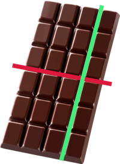

## "Шоколадка"

### Задание



Требуется определить, можно ли от шоколадки размером n × m долек отломить k долек , если разрешается сделать один разлом
по прямой между дольками (то есть разломить шоколадку на два прямоугольника)

### Формат входных данных

Вводятся 3 целых положительных числа n, m и k. Точно известно, что k ≠ n ⋅ m.

### Формат выходных данных

Выведите "Да", если можно отломить от шоколадки ровно k долек, и "Нет" если нельзя.

### Решение задачи

```python
# TODO: you code here...
```
n = int(input("Введите n: "))
m = int(input("Введите m: "))
k = int(input("Введите k: "))

if k % n == 0 and k // n < m or k % m == 0 and k // m < n:
    print("Да")
else:
    print("Нет")
---

