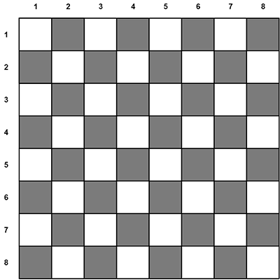

## "Клетки шахматной доски"

### Задание

Имеем стандартное поле шахматной доски размеров 8x8



Даны координаты двух клеток на шахматной доске.

Определить, одинакового ли цвета клетки?

### Формат входных данных

Даны четыре целые числа в диапазоне [1, 8]

### Формат выходных данных

Вывести "Да", если клетки с заданными координатам одинакового цвета, и "Нет", если разного.

### Решение задачи

```
x1, y1, x2, y2 = map(int, [input() for _ in range(4)])

if (x1 % 2 == x2 % 2) and (y1 + y2) % 2 == 0:
    print("Да")
elif ((x1 + x2) % 2 != 0) and ((y1 + y2) % 2 != 0):
    print("Да")
else:
    print("Нет")
```

---

### Подсказки

<details>
<summary>Подсказка-1</summary>
Условие для проверки четности числа:

```python
n % 2 == 0
```

</details>

<details>
<summary>Подсказка-2</summary>
Сумма двух нечетных чисел, всегда четная.
</details>
